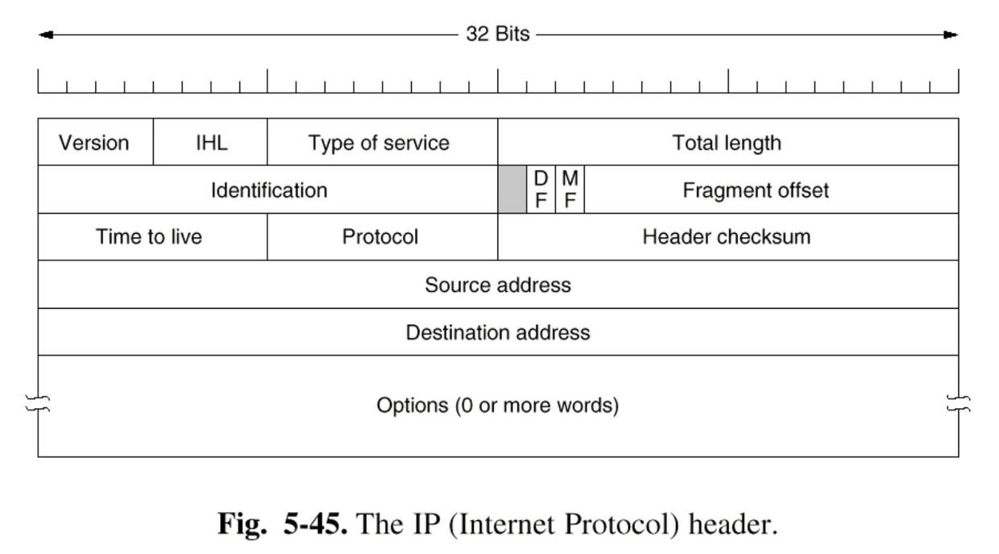

# 计算机网络 总结

> 2021年秋季学期 计算机网络 李风华 清华大学
> 
> 无97 王进钊 总结笔记

## 授课思路

* 计算机网络的发展历史和基本概念(2课时)
* 计算机网络体系结构(3课时)
* 物理层技术(2课时)
* 数据链路层技术(6课时)
* 网络层技术(7课时)
* 传输层技术(4课时)
* 应用层技术(4课时)

## 1 概论

**计算机网络**：

* A computer network is a collection of autonomous computers,
interconnected by communication channels.
* 自治的计算机通过通信信道互连起来的集合体
    * 自治 (Autonomous)
    * 互连 (Interconnected)
    * 集合体 (Collection)
 
**计算机网络的分类**：

（基于空间距离）局域网 LAN、城域网 MAN、广域网 WAN、个域网 PAN
 
**计算机网络的组成**：

* 直观角度
    *  节点（用户主机、交换机、路由器）
    *  通信链路（双绞线、光纤、无线信道）
* 逻辑角度
    * 通信子网（通信链路、路由器、交换机）
    * 资源子网（用户主机、服务器）

**计算机网络通信**：

分组的传递

**计算机网络基本通信方式**：

* 广播式通信
* 交换式通信（简单、灵活、可扩展、健壮）

## 2 计算机网络体系结构

**计算机网络的基本功能**：

* 为地理位置不同的计算机用户之间提供访问通路（连接性；可标识、可定位；正确性；其他）
* 计算机网络中提供的功能是分层次的

**计算机网络体系结构**：协议与服务

* 协议：同层之间 (层内功能)
* 服务：不同层次之间 (层间关系)，分服务提供者和服务用户

---

* 服务访问点SAP (Service Access Point)
    * 任何层间服务都是在接口上的SAP进行的
* 接口数据单元IDU (Interface Data Unit)
    * IDU由上层的服务数据单元SDU(Service Data Unit)和接口 控制信息ICI(Interface Control Information)组成
* 协议数据单元PDU(Protocol Data Unit)
    * PDU由上层的服务数据单元SDU或其分段和协议控制信息PCI (Protocol Control Information)组成

**分层**：

* 优点
    * 模块化：易于开发、管理和维护
    * 独立性：层次内部的变化不会影响其他层次
    * 复用性：高层模块可以复用底层模块的功能
    * 标准化：为不同厂家的设备互联提供条件
* 缺点
    * 低效：信息屏蔽导致性能优化困难

**ISO/OSI参考模型**：

* 7 应用层：为应用程序提供访问网络的功能
* 6 表示层：数据表示
* 5 会话层：主机间会话管理
* 4 传输层：端到端数据传输（段）
* 3 网络层：定址和寻址（分组）
* 2 数据链路层：介质访问（帧）
* 1 物理层：比特传输（比特）
* （糟糕的时间、糟糕的技术、糟糕的实现、糟糕的策略）

**TCP/IP参考模型**：

* 应用层(Application Layer)
    * 提供各种Internet管理和应用服务
* 传输层(Transport Layer)
    * 提供端到端的数据传输服务
* 互连网层/IP层(Internet Layer)
    * 控制通信子网提供源点到目的点的分组传送
* 主机至网络层(Host-to-Network/Network Interface)
    * 物理层(Physical Layer)
    * 数据链路层(Data Link Layer)
    * TCP/IP协议没有进行明确规定

**课程中使用的模型**：

* 5 应用层
* 4 传输层
* 3 网络层
* 2 数据链路层
* 1 物理层

## 3 物理层技术

**物理背景**：

有限的带宽限制了数据的传输速率

**常见的编码方式**：

* 非归零码 NRZ
* 曼彻斯特码 Manchester 相位编码
* 差分曼彻斯特码 Differential Manchester
* 逢“1”变化的NRZ码
* 逢“0”变化的NRZ码

**载波传输**：

ASK FSK PSK

**多路复用**：

* 时分复用TDM (Time Division Multiplexing)
* 频分复用 FDM (Frequency Division Multiplexing)
* 波分复用 WDM (Wavelength Division Multiplexing)

**交换方式**：

* 电路交换：建立电路，传输数据，拆除电路
    * 电路交换适用于实时信息和模拟信号传送，在线路带宽比较低的情况下使用比较经济
* 报文交换
    * 报文交换适用于线路带宽比较高的情况，可靠灵活， 但延迟大
* 分组交换：数据包、虚电路
    * 分组交换缩短了延迟，也能满足一般的实时信息传送。 在高带宽的通信中更为经济、合理、可靠。是目前公认较(最)好的一种交换技术

## 4 数据链路层技术

**数据链路层**：

如何在有差错的线路上，进行无差错传输

**成帧**：

将比特流分成离散的帧，并计算每个帧的校验和（字符计数法、带字符填充的首尾字符定界法、带位填充的首尾标记定界法、物理层编码违例法）

**差错控制**：

接收方给发送方一个反馈/响应

**纠错码**：海明码

位号为2的幂的位是校验位，其余是信息位；为看清数据位k对哪些校验位有影响，将k写成2的幂的和（例：11 = 1 + 2 + 8，即如果校验位0 1 3出错，则数据位11出错）。只能纠1bit错误

**检错码**：CRC码

选取一个r阶的多项式。发送端在帧末尾加r个0，用模2的运算做除法得到余数添加到帧末；接收端直接除，整除则没出错，非整除则出错。

**数据链路层基本协议**：

* 单工停等协议(A Simplex Stop-and-Wait Protocol)
* 有噪声信道的单工协议(A Simplex Protocol for a Noisy Channel)
* 滑动窗口协议(Sliding Window Protocol)
* 选择重传协议(A Protocol Using Selective Repeat)

## 5 数据链路层技术 2

**信道分配方式**：

静态分配、动态分配

**信道竞争协议/多路访问协议**：

* 纯ALOHA协议
* 分槽ALOHA协议
* 载波监听多路访问协议CSMA(Carrier Sense Multiple Access Protocols)
* 1-坚持型CSMA(1-persistent CSMA)
* 非坚持型CSMA(non-persistent CSMA)
* p-坚持型CSMA(p-persistent CSMA)
* 带冲突检测的载波监听多路访问协议CSMA/CD

**局域网技术**：

* （从上到下，网络层）
* LLC 逻辑链路控制子层 LLC(Logical Link Control)：确认机制和流量控制
* MAC介质访问控制子层 MAC(Medium Access Control)：数据封装(发送和接收)、介质访问管理
* （物理层）

**网桥技术**：

* 网桥(bridge)是工作在数据链路层的一种网络互连设备，它在互
连的LAN之间实现帧的存储和转发
* 作用：扩展局域网段、隔离冲突域
* 工作原理：
    * 网桥工作在混杂(promiscuous)方式，接收所有的帧;
    * 网桥接收到一帧后，通过查询地址/端口对应表来确定是丢弃还是转发;
    * 网桥刚启动时，地址/端口对应表为空，采用洪泛(flooding)方法转 发帧;
    * 在转发过程中采用逆向学习(backward learning)算法收集MAC地址。 网桥通过分析帧的源MAC地址得到MAC地址与端口的对应关系,并写入地址/端口对应表;
    * 网桥软件对地址/端口对应表进行不断的更新，并定时检查，删除在 一段时间内没有更新的地址/端口项;
* 解决多个网桥产生回路的问题：让网桥之间互相通信，用一棵连接每个LAN的生成树(Spanning Tree)覆盖实际的拓扑结构

## 6 网络层技术 1

**网络层**：

了解通信子网的拓扑结构，选择路由；提供面向连接和无连接的服务

IP协议：

**定址**：

* 地址组成：子网掩码（1...1 0...0）前半部分为网络号、后半部分为主机号。主机号全0表示本主机、全1表示广播地址
* 无类域间路由CIDR(Classless InterDomain Routing)：最长匹配原则:路由查找时，若多个路由表项匹配成功，选择掩码长 (1比特数多)的路由表项;

**Internet控制协议**：

* Internet控制消息协议ICMP(Internet Control Message Protocol)：主要用来报告出错和测试，ICMP报文封装在IP包中
* 地址解析协议ARP(Address Resolution Protocol)：解决网络层地址(IP地址)与数据链路层地址(MAC地址)的映射问题;
* 反向地址解析协议RARP(Reverse Address Resolution Protocol)：解决数据链路层地址(MAC地址)与网络层地址(IP 地址)的映射问题

## 7 网络层技术 1

**寻址/路由** Routing

**距离向量路由算法**：

* 解决路由环路的方法：
    * 水平分割:路由信息交互时，不把从各个相邻节点学习到
     的路由信息发送回原来的节点
    * 反向抑制/毒性反转:路由信息交互时将故障链路的开销设置为无限大
    * 触发更新:一旦网络状态发生变化，就强制发出更新信息，
     在其他路由器更新周期到达之前，更新所有路由表
* 典型的距离向量路由协议：RIP路由协议

链路状态路由协议

* Dijkstra算法
* 缺点：
    * 算法初始阶段带宽开销较大
    * 算法需要较大的CPU和内存开销
    * 网络规模较大或链路状态变化频繁时，效率较低
* 典型的链路状态路由协议：OSPF:开放的最短路径优先协议

**距离向量路由算法总结**

* 从邻居节点的角度了解网络结构
* 以跳数为开销衡量标准
* 交互路由表
* 周期性路由信息交互

**链路状态路由算法总结**

* 了解整个网络的拓扑结构
* 多种参数组合作为衡量标准
* 交互LSP，计算最短路径树
* 触发更新

## 8 网络层技术 3

**域间路由协议**：

* 策略控制
* 边界网关协议BGP (Border Gateway Protocol)

**下一代互联网网络层协议**：IPv6

* 现在还是孤岛，但之后会成为汪洋

## 9 传输层技术 1

**传输层**：

* 消除网络层的不可靠性
* 提供从源端主机到目的端主机的可靠的、与实际使用的网络无关的信息传输。

**传输层提供的两种服务**：

* 面向连接的传输服务：连接建立，数据传输，连接释放
* 无连接的传输服务

**建立连接**：

（Connect Request / Connect Acknowledge TPDU (Transport Protocol Data Unit, 传输协议数据单元)）

* 客户端：发送CR TPDU - 阻塞 - 收到CA TPDU - 连接建立
* 服务器端：LISTEN(阻塞) - 收到CR TPDU - 发送CA TPDU - 连接建立

**拆除连接**

* 不对称方式：任何一方都可以关闭双向连接
* 对称方式：每个方向的连接单独关闭，双方都执行Disconnect才能关闭整条连接

**TCP** Transmission Control Protocol 传输控制协议：

* 连接管理：建立连接：三次握手；释放连接：三次握手 + 定时器
* 可靠传输：滑动窗口
* 流控制和拥塞控制：可变滑动窗口、慢启动、拥塞避免

**三次握手**：三次握手方案解决了由于网络层会丢失、存储和重复 包带来的问题

* A 发出序号为X的CR TPDU;
* B 发出序号为Y的CA TPDU并确认A的序号为X的CR TPDU;
* A 发出序号为X+1的第一个数据TPDU，并确认B的序号为Y 的CR TPDU。

**标识位**：置1表示有效

- URG urgent：和紧急指针配合使用，发送紧急数据;
- ACK acknowledge：确认号是否有效;
- PSH push：指示发送方和接收方将数据不做缓存，立刻发送或接收;
- RST reset：由于不可恢复的错误重置连接;
- SYN sync：用于连接建立指示;
- FIN finish：用于连接释放指示

**拥塞窗口** (Cwnd, Congestion Window)的确定

* 初值为一个MSS (Max Segment Size)
* 变化：考虑吞吐率和公平性，采用AIMD (Additive Increase / Multiplicative Decrease)

**UDP** User Datagram Protocol 用户数据报协议：

* 不需要建立连接，延迟小；经常用于流媒体应用
* best effort服务，UDP 报文可能会丢失、乱序

## 10 应用层技术

**网络应用程序**：相互通信的分布的进程

**应用层协议**：利用底层协议提供的服务，定义应用程序直接交换的信息及相应的动作

进程如何指明它要与之通信的另一个进程：

* IP地址指明该进程所在的主机
* 端口号指明该主机应该把收到的数据交给哪个当地进程

**客户/服务器模型**：

* 客户/服务器模型是所有网络
应用的基础。
* 客户/服务器分别指参与一次通信的两个应用实体，客户方主动地发起通信请求，服务器方被动地等待通信的建立

一些基础的互联网服务：

* 域名服务 DNS
* WWW服务
* 电子邮件
* P2P
